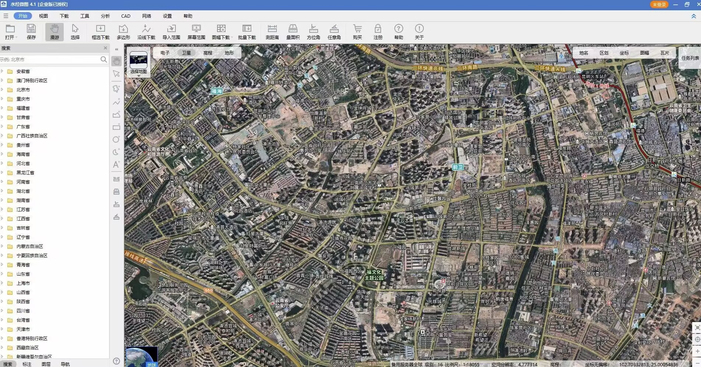
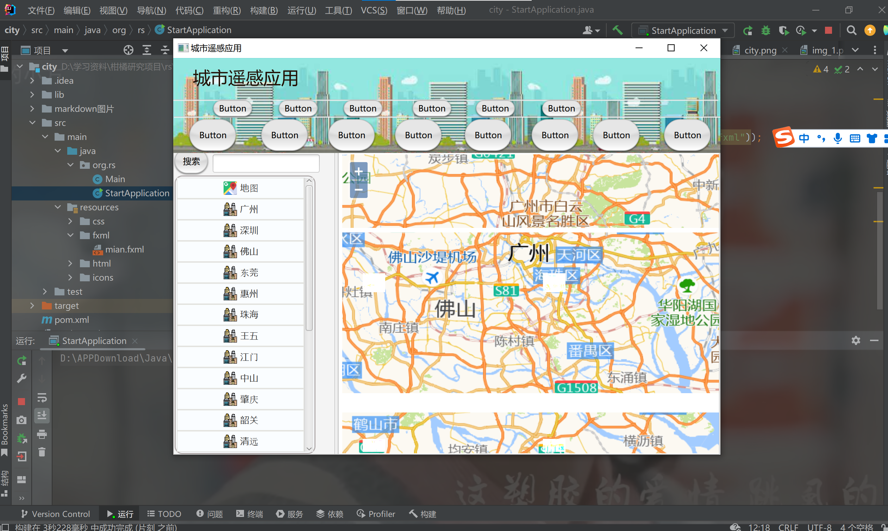

# :world_map: ​城市遥感应用简介

## :balloon:目标

仿照以下页面，完成城市遥感应用的界面编写，具体要求见视频

## :pencil:当前项目所用到的工具及技术栈

JDK1.8

界面编写：javafx

SceneBuilder：用于可视化编程及查看javafx的界面

## :scroll:当前完成的界面展示

## :star:如何运行

点击StartApplication.java文件的main函数即可运行